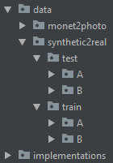

# Exjobb
Starta en värld
1.	Starta världen image_generator
2.	I ”Content Browser” starta Content/Blueprints/level_blueprint
3.	I övre högre hornet finns ett fönster “World Outliner” byt flik till “Levels”
4.	Klicka på ”Levels” och klicka på ”Add Existing..”
5.	Välj en värld
6.	Högerklicka på den valda världen i ”Levels”-fliken, ”Change Streaming Method” välj ”Always loaded”

Generera bilder, skapa dataset och träna en klassificerare
1.	Spara ner koordinater manuellt för kameran i ”UnrealCV/unrealcv-master/variabler/camera_traj.json”
2.	Placera ut 3D-modellen på en valfri plats
3.	I img_gen.py ändra variabeln ”camera_positions” till antalet nedsparade kameravinklar
4.	Tryck på ”Play”(New Editor Window(PIE))
5.	Kör img_gen.py
6.	I “Epic Games\UE_4.16\Engine\Binaries\Win64\samples” har bilderna sparats och bounding boxes har sparats ner i ”UnrealCV/unrealcv-master/variabler/uncut.json”. 
7.	Som lösningen ser ut just nu så måste du manuellt flytta bilderna till ”UnrealCV/unrealcv-master/bb_generator/images” och json-filen flyttas till ”bb_generator”-mappen.
8.	Merga alla json-filer (som json_merge.py)
9.	Kör image_cropper.py
10.	Kör dataset_gen.py
11.	Kopiera över mappen ”bb_generator/images” och json-filerna som skapades i steg 10 till camouflage_classifier mappen
12.	Nu ska det gå att träna en valfri klassificerare och testa den.

Domänöversättning
1.	Kör resize.py
2.	Flytta över bilderna till cyclegan-projektet i data-mappen och ha följande format.

3.	Öpnna cyclegan-projektet
4.	Kör igång implementations/cyclegan/cyclegan.py
5.	Kör igång filter.py, ändra G_AB.load_state_dict till den färdigtränade modellen
6.	Flytta över den genererade mappen till UnrealCV-projektet
7.	Kör domain_json.py 
8.	Med det dataset som skapades i steg 7 och bilderna som skapades i steg 5 så ska det kunna köras i camouflage_classifier 

